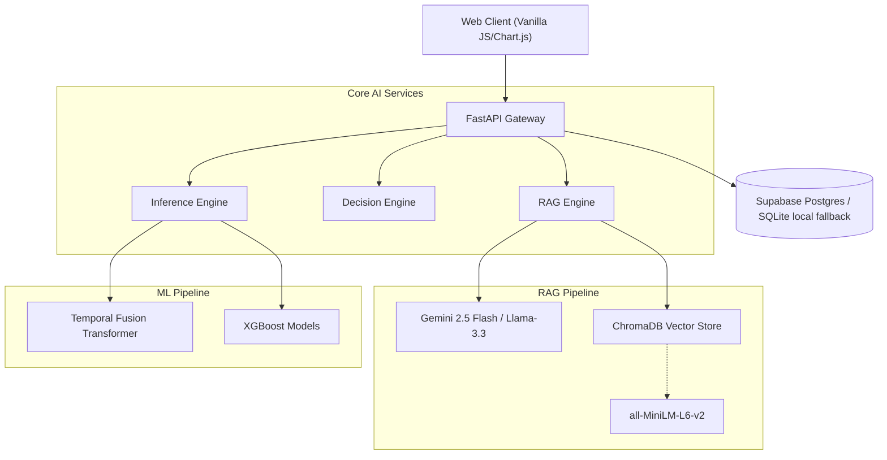

# 🌾 Trợ Lý Thần Nông (Agricultural AI Ecosystem)

[](https://www.python.org/downloads/)
[](https://fastapi.tiangolo.com)
[](https://langchain.com/)
[](https://www.docker.com/)

An enterprise-grade, highly scalable Agricultural AI Decision Support System designed specifically for the Central Highlands (Lâm Đồng) region of Vietnam. The platform integrates a **Retrieval-Augmented Generation (RAG)** pipeline for real-time agronomic consultation, alongside an advanced **Machine Learning subsystem** utilizing Temporal Fusion Transformers (TFT) and XGBoost for market price forecasting and ecological risk assessment.

---

## 🏗️ System Architecture

The architecture follows a microservice-ready, domain-driven design pattern built on top of asynchronous Python (FastAPI).



## 🚀 Core Capabilities & Technical Highlights

### 1. Hybrid RAG Engine (Agronomic Knowledge Base)
- **Vector Search**: Utilizes `ChromaDB` for high-dimensional semantic search across 1,500+ pages of standardized agricultural guidelines (VietGAP, CropLife, WASI).
- **Embeddings**: `sentence-transformers/all-MiniLM-L6-v2` for localized Vietnamese text embedding optimization.
- **LLM Orchestration**: Powered by `LangChain`. Implements an asynchronous fallback mechanism (Primary: `Gemini 2.5 Flash` via Google GenAI SDK, Secondary: Local LLMs via LM Studio/OpenRouter) to ensure 99.9% uptime during high-load periods.
- **Prompt Engineering**: Context-aware injection with hard constraints against hallucination and out-of-scope non-agricultural queries.

### 2. Multi-Model Predictive Analytics
- **Temporal Fusion Transformer (TFT)**: Applied via `pytorch-forecasting` for multivariate time-series forecasting (Robusta Coffee prices), incorporating global weather anomalies and macro-economic indicators.
- **Gradient Boosting (XGBoost)**: Low-latency inference for non-stationary commodities (Durian, Oolong Tea) with automated feature engineering pipelines (lag features, rolling means).
- **Runtime fallback**: Coffee price forecasting currently uses a deterministic historical-statistical model from processed CSV data when legacy TFT checkpoints are incompatible with the deployed Python/Pandas runtime.

### 3. Financial & Ecological Decision Engine
- **Expert Rules Engine**: A localized ruleset evaluating real-time weather APIs (temperature, precipitation) against optimal ecological parameters (elevation, crop cycle) to predict yield risk.
- **ROI Simulation**: Real-time CAPEX/OPEX modeling computing Estimated Cost, Projected Revenue, and ROI percentage based on dynamically predicted market prices.

### 4. High-Performance Asynchronous Backend
- **Framework**: `FastAPI` running on `uvicorn` (ASGI), enabling non-blocking I/O for concurrent AI model inference.
- **Rate Limiting & Security**: Implemented `slowapi` for memory-based endpoint throttling. JWT-based authentication with bcrypt password hashing for admin endpoints.

---

## 🛠️ Technology Stack

| Domain | Technologies |
| :--- | :--- |
| **Backend Framework** | `FastAPI`, `Uvicorn`, `Pydantic` (V2) |
| **Database & ORM** | `SQLAlchemy` 2.0, `Supabase Postgres`, `SQLite` local fallback |
| **Vector Database** | `ChromaDB` |
| **AI / LLM Orchestration** | `LangChain`, `Google GenAI SDK`, `OpenAI Async SDK` |
| **Machine Learning** | `PyTorch 2.x`, `PyTorch Lightning`, `XGBoost`, `Scikit-learn`, `Pandas` |
| **Frontend UI/UX** | Vanilla JS, Modern CSS (Glassmorphism), `Chart.js` |
| **Deployment** | `Docker`, `Hugging Face Spaces` |

---

## 💻 Local Development Setup

### Prerequisites
- Python 3.11+
- Git LFS (for downloading model weights)
- Docker (optional, but recommended)

### 1. Environment Configuration

Clone the repository and configure the `.env` file in the `server/` directory:

```bash
git clone https://github.com/Messiac24/tro-ly-than-nong.git
cd tro-ly-than-nong/server
cp .env.example .env
```

**Required Environment Variables:**
```env
# AI Model Configuration
GEMINI_API_KEY="your_google_ai_studio_key"
OPENROUTER_API_KEY="your_openrouter_key"
LM_STUDIO_URL="http://127.0.0.1:1234/v1"

# Database & Security
# Local default:
DATABASE_URL="sqlite:///./data/nongsan_v2.sqlite3"
# Supabase production:
# DATABASE_URL="postgresql://postgres:[PASSWORD]@[HOST]:5432/postgres"
SECRET_KEY="your_jwt_secret_key"
DEFAULT_ADMIN_PWD="admin_password"
```

### Supabase Database Setup

Use the Supabase Postgres connection string as `DATABASE_URL`. The app still falls back to
`server/data/nongsan_v2.sqlite3` when `DATABASE_URL` is not set, so local development keeps
working without Supabase.

```powershell
cd server
$env:DATABASE_URL="postgresql://postgres:[PASSWORD]@[HOST]:5432/postgres"
python migrate_db.py
```

To copy existing local SQLite users, chat history, and prediction history into Supabase:

```powershell
cd server
$env:SUPABASE_DATABASE_URL="postgresql://postgres:[PASSWORD]@[HOST]:5432/postgres"
python migrate_sqlite_to_supabase.py
```

### 2. Standalone Execution (Virtual Environment)

```bash
# Create and activate virtual environment
python -m venv .venv
source .venv/bin/activate  # On Windows: .venv\Scripts\activate

# Install dependencies
pip install --upgrade pip
pip install -r requirements.txt

# Run the FastAPI server
uvicorn main:app --host 0.0.0.0 --port 8000 --reload
```

### 3. Dockerized Deployment (Production)

```bash
# Build the multi-stage Docker image
docker build -t messiac24/tro-ly-than-nong:latest .

# Run the container
docker run -d --name thannong_api -p 8000:8000 --env-file server/.env messiac24/tro-ly-than-nong:latest
```

---

## 📂 Repository Structure

```text
.
├── client/                 # Frontend assets (HTML, CSS, JS, Chart.js)
├── server/                 # FastAPI Backend Application
│   ├── ai_models/          # Pre-trained ML weights (.pkl, .ckpt)
│   ├── data/               # SQLite DB & ChromaDB persistence layer
│   ├── ml/                 # RAG Engine, Inference Scripts, Rules Engine
│   ├── routers/            # API Endpoints (Auth, Chat, Predict, Admin)
│   ├── config.py           # Centralized configuration mapping
│   ├── main.py             # ASGI Application entry point
│   └── requirements.txt    # Python dependencies
├── testsprite_tests/       # Automated test cases
└── Dockerfile              # Production-optimized Docker build instructions
```

---

## 📊 API Endpoints Overview

| Method | Endpoint | Description |
| :--- | :--- | :--- |
| `POST` | `/api/chat` | Main interaction endpoint for the RAG Assistant |
| `POST` | `/api/predict/price` | Retrieves TFT/XGBoost 30-day price forecasts |
| `POST` | `/api/predict/risk` | Evaluates ecological viability for specific crops |
| `GET`  | `/api/chat/history`| Retrieves contextual conversation history for users |
| `GET`  | `/health` | Kubernetes-compatible liveness probe |

---
